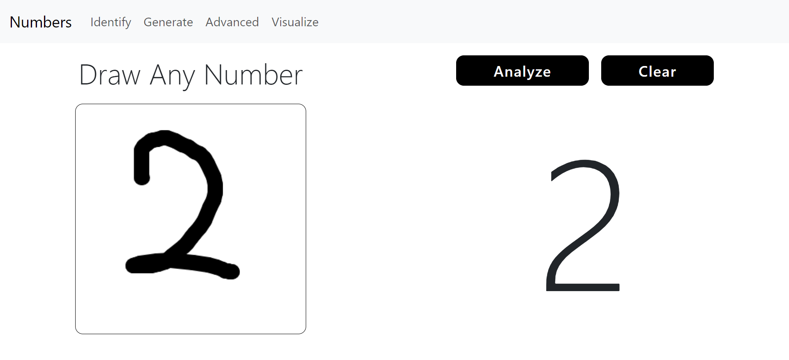
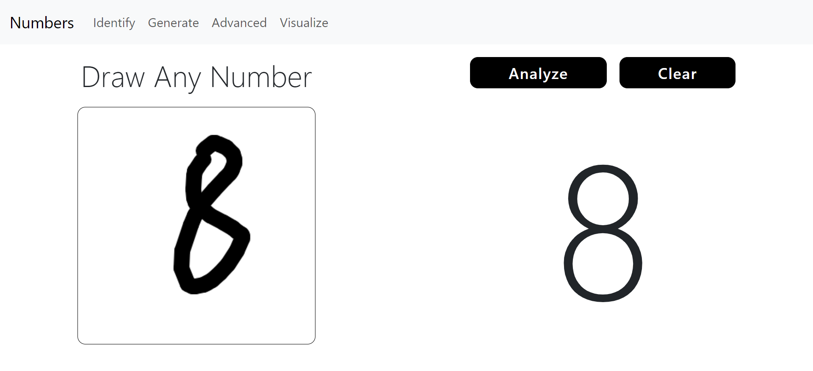
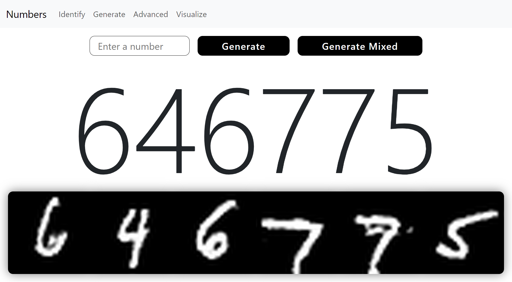
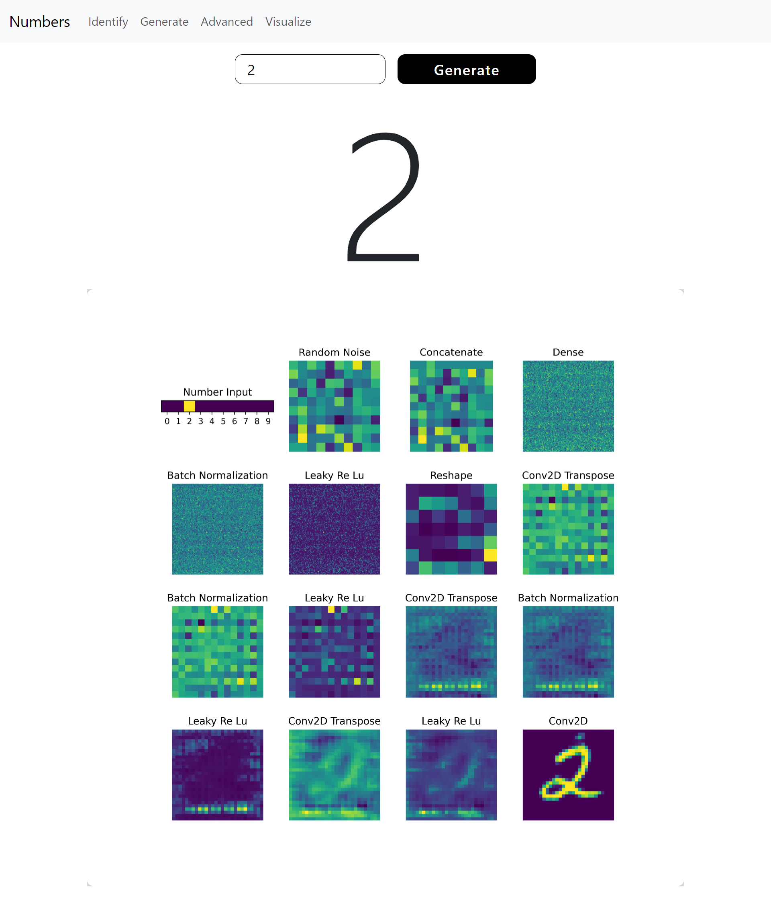
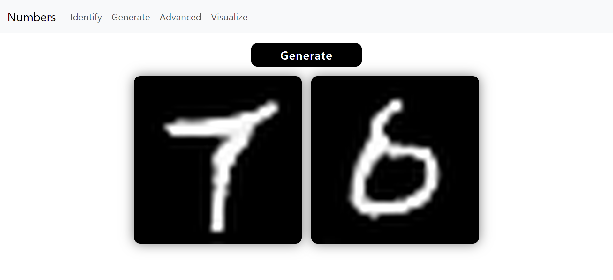
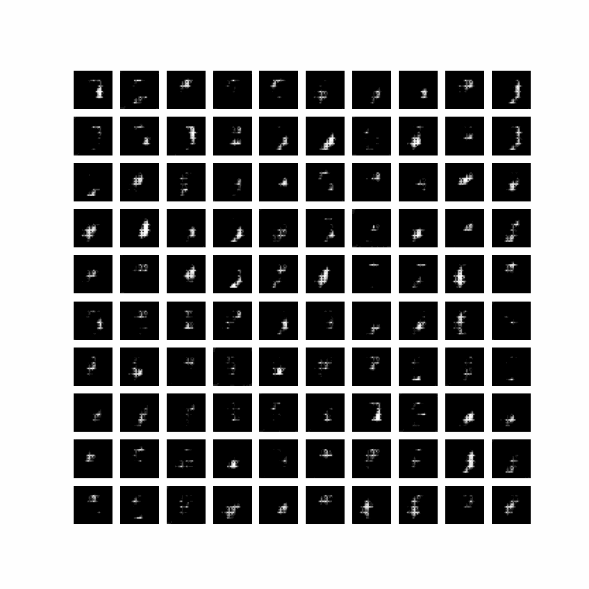

# Handwritten Digit Recognition and Generation

Welcome! This project explores the exciting world of handwritten digit recognition and generation using neural networks.

# Table of Content

1. [Introduction](#introduction)
2. [Demonstration](#demonstration)
3. [Training Process](#training-process)
4. [Features](#features)
5. [Installation & Usage](#installation--usage)

# Introduction
At its core, the project features two main functions. First, there's the **identification model**, which accurately recognizes handwritten digits. Simply draw a number and analyze the result!

But that's just the beginning! The project also includes a **generation model** that allows you to specify any digit you’d like to create. Want to see a unique version of a "5" or a playful "2"? Just let the model know, and it will generate a realistic handwritten representation for you.

With engaging demos, insights into the training process, and customizable options, this project is perfect for anyone curious about machine learning and computer vision. Dive in and discover how AI can bring handwritten digits to life!

# Demonstration

### Handwritten Digits Identification
Two examples of the drawn number appear on the left, with their analyses displayed on the right.





### Handwritten Digits Generator (Advanced Model)

Example of the model generating handwritten numbers. The top row shows the number the model was instructed to draw, while the bottom row displays the generated numbers.



### Visualizing steps of Generator (Advanced) drawing a digit



### Handwritten Digits Generator (Basic Model) - *My First Try*

Example of the model generating random digits.



# Training Process

The neural network models were trained using `tensorflow` in `python`, utilizing Kaggle's GPU P100. If you're interested in the details, you can check out the code in these notebooks:

- [Basic Model](training/basic-model.ipynb)
- [Advanced Model](training/advanced-model.ipynb)

The **Basic Model** was my first attempt at creating a handwritten digit generator using the **GAN (Generative Adversarial Network)** approach. While working on it, I realized that using a labelled dataset could lead to better results, which inspired me to create the **Advanced Model**. Unlike the basic model, which generates random digits, the advanced model lets you choose the specific digits you want. I later learned that this approach is called **cGAN (Conditional Generative Adversarial Network)**.

Here are gifs showing how both models progressed during training:

### Training Basic Model


### Training Advanced Model


# Features

I have developed a Flask web application for this, where you can use all three models: number recognition, basic number generation, and advanced number generation. The web app contains four main features:

- **Identify**: Draw a number and analyze which number was recognized.
- **Generate**: Generate random numbers effortlessly.
- **Advanced**: Specify which numbers you want to generate for improved results. Plus, there’s a special button called "Generate Mixed"—give it a try and see what it does!
- **Visualize**: View a visual representation with images that show step-by-step how the advanced model generates a specific number within the neural network.

# Installation & Usage

To get started with the app, follow these steps:

1. **Clone the Repository**
   ```bash
   git clone
   ```

2. **Install Dependencies**
   ```bash
   pip install -r requirements.txt
   ```

Once everything is set up, you can run the app with the following command:

```bash
flask run
```

Then, open your web browser and go to http://127.0.0.1:5000 to start exploring!